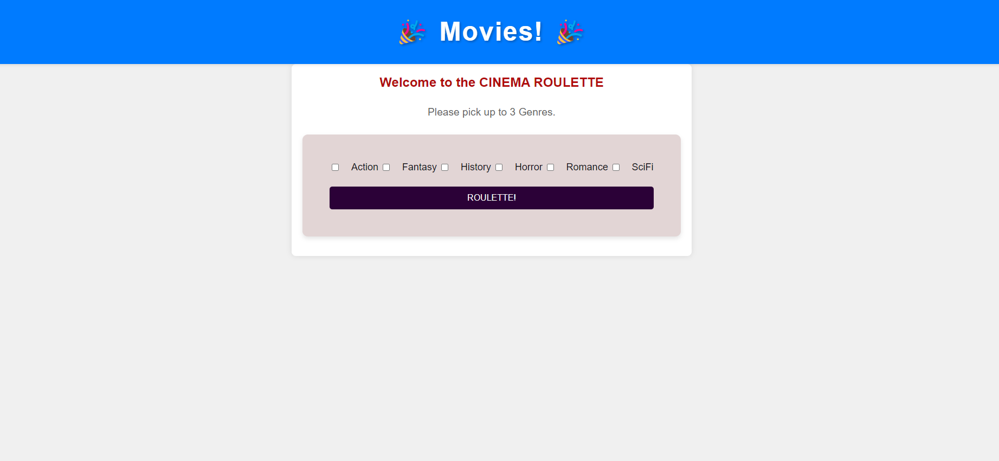

CINEMA ROULETTE

The application uses a Node and Express backend and utilizes both GET and POST routes for retrieving and adding new data

The application uses TMDB Movies API to refrence selections by user

When you look at the application's folder structure,
Then you will see it follows the MVC(Model-View-Controller)paradigm

When you render the home page,
Then the application displays 6 movie genres to pick utilizing Handlebars.js as the template engine of the checkboxes

When you need to store and retrieve data,
Then the application is backed by a MySQL database

When you interact with the database,
Then Sequelize ORM is used to manage and interact with the MySQL database

When handling API keys and sensitive information,
Then the application uses environemnt variables to protect them

Link to deployed application: 

API: https://api.themoviedb.org/3/genre/movie/list?language=en' \

Walkthrough video: